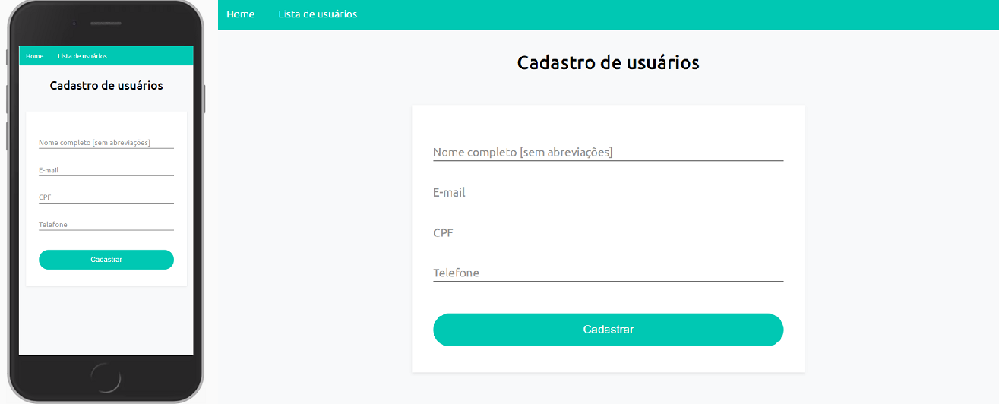
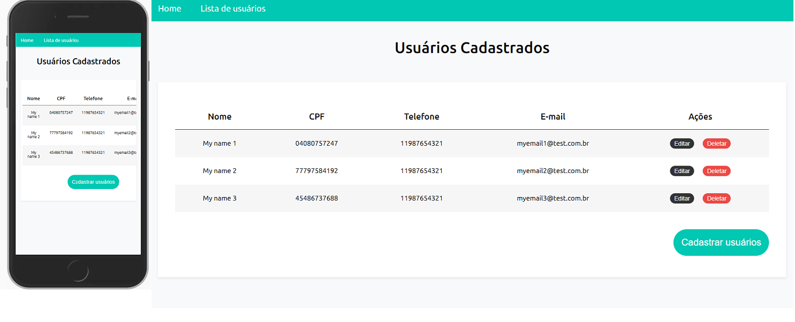

<h1 align="center">
    User App 💻
</h1>

<p align="center">
 <a href="#objective">Objetivos</a> •
 <a href="#technologies">Tecnologias</a> • 
 <a href="#usage">Como rodar a aplicação</a> • 
 <a href="#author">Autora</a> 
</p>

<div style="display: flex; flex-direction: row;">
  
<div>
<div style="display: flex; flex-direction: row;">
  
<div>

<h2 id="objective" > 🎯 Objetivos </h2>

Desenvolver uma aplicação que deve conter duas páginas, uma que exibe um formulário para cadastro de dados, e outra que liste os dados cadastrados.

<h2 id="technologies"> 🛠 Tecnologias </h2>

- [NodeJS](https://nodejs.org/en/)
- [VSCode](https://code.visualstudio.com)
- [Jasmine](https://jasmine.github.io/)
- [JavaScript](https://www.javascript.com/)


<h2 id="usage" > 👷 Como rodar a aplicação </h2>

```bash
# Clone Repository
$ git clone https://github.com/andressamiki/user-app.git

# Go to server folder
$ cd user-app

# Install Dependencies
$ npm install

# Run Aplication
$

# Access localhost

# Testing
$ npm test

# Compile .scss
$ npm run gulp-windows

```

<h2 id="author"> 💻 Autora </h2>


[](https://www.linkedin.com/in/andressa-de-souza-miki-022630b2)
[](https://github.com/andressamiki)
